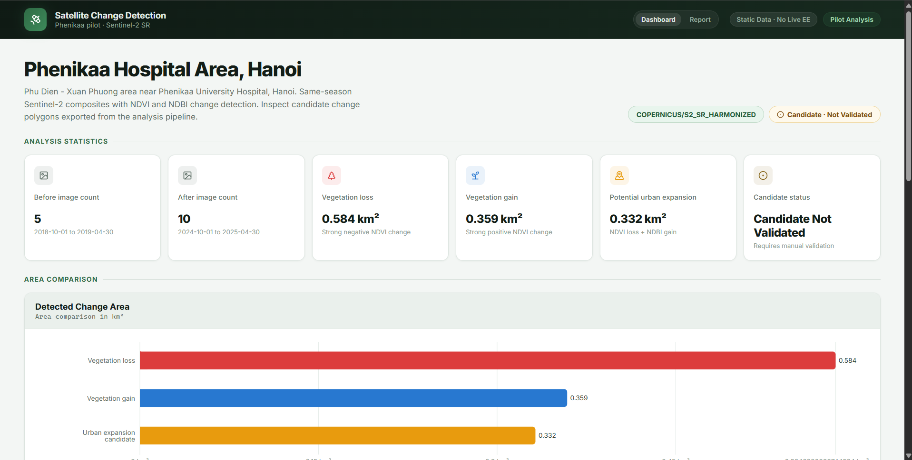
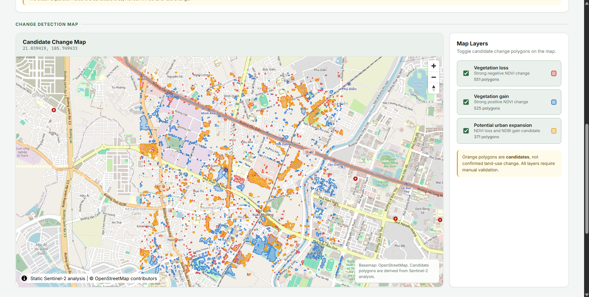
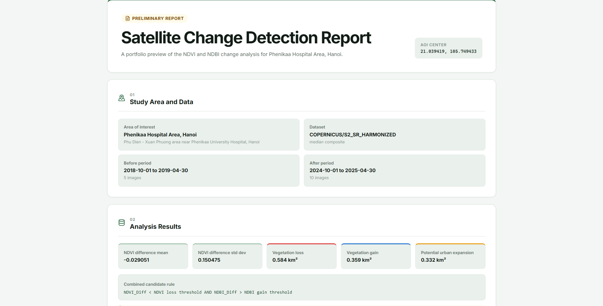
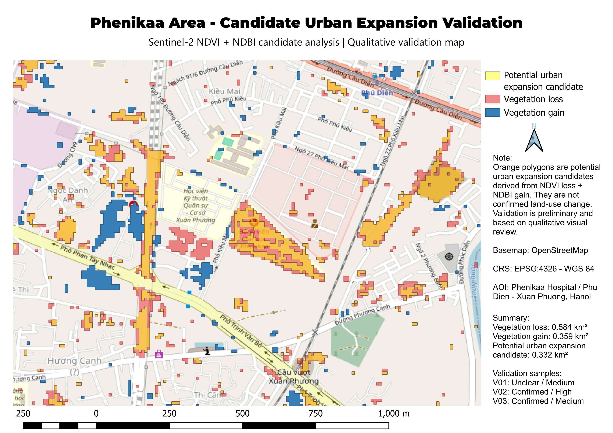

# Satellite Change Detection Dashboard

A reproducible remote sensing and WebGIS portfolio project for detecting,
reviewing, and communicating vegetation change and potential urban expansion
signals around Phenikaa Hospital and the Phu Dien - Xuan Phuong area of Hanoi.

The project connects a Google Earth Engine analysis pipeline to QGIS validation
and a React dashboard. It uses real Sentinel-2 outputs rather than mock
dashboard data.

**Live demo:** [https://satellite-change-dashboard.vercel.app](https://satellite-change-dashboard.vercel.app)

> **Important:** Potential urban expansion is a candidate layer, not confirmed
> land-use change. Validation is preliminary and is not a full statistical
> accuracy assessment.

## Live Demo

Explore the deployed dashboard and preliminary report:

- [Dashboard](https://satellite-change-dashboard.vercel.app/)
- [Report preview](https://satellite-change-dashboard.vercel.app/report)

## Why This Project Matters

This project demonstrates an end-to-end geospatial workflow:

1. Build a reproducible Sentinel-2 analysis in Earth Engine.
2. Export statistics, candidate polygons, and comparison rasters.
3. Inspect and qualitatively validate candidate locations in QGIS.
4. Communicate results and uncertainty through an interactive WebGIS
   dashboard and report preview.

It is designed as a job-ready portfolio example for remote sensing, GIS
analysis, spatial data production, QGIS, and frontend geospatial visualization.

## Key Features

- Reproducible Sentinel-2 Surface Reflectance Harmonized notebook.
- Same-season before/after comparison to reduce seasonal mismatch.
- SCL cloud masking and median composites.
- NDVI vegetation loss and gain detection using an AOI-relative
  `mean +/- 1.5 standard deviation` threshold.
- Potential urban expansion candidate rule combining strong NDVI loss with
  strong NDBI gain.
- JSON statistics, GeoJSON candidate layers, and GeoTIFF comparison outputs.
- QGIS validation project and exported validation map.
- MapLibre dashboard with an OpenStreetMap basemap, layer controls, statistics,
  and an area comparison chart.
- Portfolio-friendly `/report` preview using the same static analysis JSON.
- Explicit uncertainty language throughout the analysis and interface.

## Demo Screenshots

### Dashboard Overview



### Interactive Candidate Map



### Report Preview



### QGIS Validation Map



The full QGIS map exports are also available as
[PNG](qgis/outputs/phenikaa-validation-map.png) and
[PDF](qgis/outputs/phenikaa-validation-map.pdf).

## Dataset and AOI

| Item | Value |
| --- | --- |
| Area of interest | Phenikaa Hospital Area, Hanoi |
| Local description | Phu Dien - Xuan Phuong area near Phenikaa University Hospital |
| AOI center | `105.749433, 21.039419` |
| Dataset | `COPERNICUS/S2_SR_HARMONIZED` |
| Before period | `2018-10-01` to `2019-04-30` |
| After period | `2024-10-01` to `2025-04-30` |
| Before image count | 5 |
| After image count | 10 |

The October-to-April window is used for both periods. This same-season
comparison reduces, but does not eliminate, differences caused by vegetation
phenology, rainfall, crop cycles, and other seasonal conditions.

## Methodology

1. Filter Sentinel-2 SR Harmonized imagery by AOI, date, and scene cloud
   percentage.
2. Apply a pixel-level Sentinel-2 Scene Classification Layer cloud and shadow
   mask.
3. Create before and after median composites.
4. Calculate NDVI from `B8` and `B4`.
5. Calculate `NDVI_difference = NDVI_after - NDVI_before`.
6. Classify unusual vegetation loss and gain using:

   ```text
   loss = NDVI_difference < mean - 1.5 * stdDev
   gain = NDVI_difference > mean + 1.5 * stdDev
   ```

7. Calculate NDBI from `B11` and `B8`.
8. Identify potential urban expansion candidates using:

   ```text
   NDVI_Diff < NDVI loss threshold
   AND
   NDBI_Diff > NDBI gain threshold
   ```

9. Export statistics, vector candidate layers, and reproducible comparison
   rasters for QGIS and the dashboard.

Detailed methodology:

- [Analysis workflow](docs/geo/WORKFLOW.md)
- [NDVI and NDBI interpretation](docs/geo/INDICES.md)
- [Qualitative validation protocol](docs/geo/VALIDATION.md)

## Results Summary

Source: [`public/sample-analysis/phenikaa-area-ndvi-change.json`](public/sample-analysis/phenikaa-area-ndvi-change.json)

| Metric | Current pilot result |
| --- | ---: |
| Before image count | 5 |
| After image count | 10 |
| NDVI difference mean | -0.029051315005948708 |
| NDVI difference standard deviation | 0.1504748968728374 |
| Vegetation loss area | 0.5842980238744534 km2 |
| Vegetation gain area | 0.35884955265581303 km2 |
| Potential urban expansion candidate area | 0.3321838038651405 km2 |

These areas describe statistically unusual spectral-change signals within the
pilot AOI. They do not independently prove the cause of change.

## Validation Summary

Three potential urban expansion candidate locations received initial
qualitative review using QGIS candidate polygons, reproducible Sentinel-2
comparison layers, and optional Google Earth historical imagery context.

| Sample | Qualitative status | Confidence |
| --- | --- | --- |
| V01 | Unclear | Medium |
| V02 | Confirmed | High |
| V03 | Confirmed | Medium |

Google Earth is used only as a qualitative visual reference, not authoritative
ground truth. These three samples are preliminary observations and do not form
a full statistical accuracy assessment.

## Limitations

- Potential urban expansion is a candidate layer, not confirmed land-use
  change.
- Validation is preliminary and includes only three qualitative samples.
- Google Earth historical imagery is a qualitative visual reference only and
  can contain imagery from inconsistent acquisition dates.
- Sentinel-2 mixed pixels can blur small features and boundaries.
- NDBI uses `B11` at 20 m and `B8` at 10 m, so resampling affects the combined
  candidate signal.
- Seasonal effects, crop cycles, rainfall, soil moisture, cloud artifacts, and
  composite differences can affect interpretation.
- Bare soil and disturbed surfaces can resemble built-up surfaces in NDBI.
- The AOI-relative thresholds should be recalculated and validated before use
  in another study area.
- Vectorized polygon-area totals can differ slightly from raster pixel-area
  totals.

## Tech Stack

| Area | Technology |
| --- | --- |
| Remote sensing | Google Earth Engine, Sentinel-2 SR Harmonized |
| Notebook workflow | Python, Earth Engine Python API, geemap, rasterio |
| GIS validation | QGIS LTR |
| Frontend | React 19, TypeScript, Vite |
| Web map | MapLibre GL JS, OpenStreetMap raster basemap |
| Charts | Recharts |
| Routing | React Router |
| Automated testing | Playwright |
| Continuous integration | GitHub Actions |
| Data exchange | JSON, GeoJSON, GeoTIFF |

## How to Run Locally

Requirements:

- Node.js and npm for the dashboard.
- An authenticated Earth Engine environment with `ee`, `geemap`, and
  `rasterio` only if regenerating the analysis outputs.

Run the dashboard:

```bash
npm install
npm run dev
```

Routes:

- `/` - dashboard, statistics, area chart, and interactive candidate map
- `/report` - preliminary portfolio report preview

The frontend reads only the committed static files under
`public/sample-analysis/`. It does not connect live Earth Engine to the
browser.

### Automated Quality Checks

Install the Playwright Chromium runtime once after installing dependencies:

```bash
npx playwright install chromium
```

Run the complete local quality gate:

```bash
npm run check
```

`npm run check` runs lint, the production build, and the Playwright smoke
suite. To rerun only the browser tests after building, use `npm run test:e2e`;
`npm run test:e2e:ui` opens Playwright's interactive runner.

The smoke suite covers the dashboard root, direct and refreshed `/report`
navigation, committed report content, map and chart presence, analysis JSON,
all three GeoJSON feature collections, uncaught browser errors, and failed
same-origin requests. Third-party OpenStreetMap tile failures are excluded from
the failure gate so temporary basemap outages do not hide application health.

The GitHub Actions quality gate runs on pushes to `main` and pull requests
targeting `main`. It installs dependencies from the lockfile, builds the
production app, runs the Playwright suite, and uploads reports and traces when
tests fail. Expanded manual geographic validation remains pending and is not
replaced by these automated interface and data-contract checks.

## Repository Structure

```text
.
|-- .github/workflows/              # Build and Playwright quality gate
|-- docs/
|   |-- assets/                    # Portfolio screenshots
|   `-- geo/                       # Workflow, indices, and validation docs
|-- notebooks/
|   `-- 01_sentinel2_ndvi_change_phenikaa_area.ipynb
|-- public/sample-analysis/
|   |-- geojson/                   # Candidate polygon layers
|   |-- rasters/                   # Before/after RGB and difference GeoTIFFs
|   `-- phenikaa-area-ndvi-change.json
|-- qgis/
|   |-- outputs/                   # Validation map PNG/PDF
|   `-- phenikaa-validation.qgz
|-- src/
|   |-- components/                # Cards, charts, layout, and map
|   |-- features/dashboard/        # Interactive dashboard page
|   |-- features/report/           # Preliminary report preview
|   |-- lib/data/                  # Typed static-data loading
|   `-- types/                     # TypeScript analysis contracts
|-- tests/e2e/                     # Deployment regression smoke tests
|-- playwright.config.ts           # Production-preview browser test config
|-- PROJECT_STATUS.md
|-- PROGRESS_LOG.md
`-- README.md
```

## Skills Demonstrated

- Sentinel-2 remote sensing analysis and spectral-index interpretation.
- Same-season composite design and cloud-mask reasoning.
- Statistical thresholding and raster area calculations.
- Earth Engine export automation and reproducible notebooks.
- GeoJSON and GeoTIFF data production.
- QGIS layer styling, visual review, and print-map export.
- Qualitative validation with explicit uncertainty management.
- React and TypeScript dashboard development.
- MapLibre WebGIS integration and thematic layer controls.
- Playwright deployment regression testing and GitHub Actions CI.
- Clear technical communication for GIS reviewers and recruiters.

## Next Steps

- Expand qualitative review beyond V01-V03 using a documented sampling
  strategy.
- Build a full statistical accuracy assessment with labeled reference samples
  and a confusion matrix.
- Add more QGIS production and data-quality workflows, including geometry and
  topology checks.
- Add route-level code splitting to reduce the current frontend bundle size.
- Expand the deployed portfolio with additional validated samples and GIS
  quality-assurance workflows.

## License

This repository is publicly available for portfolio and educational review. No
open-source license has been selected yet.
